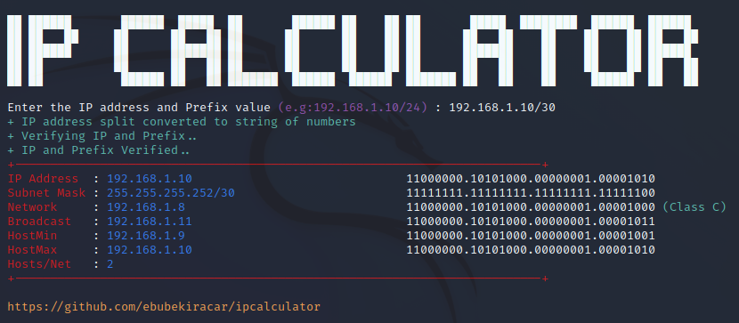

# Java IP Calculator




When you type the ipcalculator command from the terminal, you can follow the steps below to make it work.

# Installation:en

Download the **ipcalculator.jar** and **setup.sh** files. Both files must be in the same directory.

Allow setup.sh to run.
```bash
chmod +x setup.sh
```
Run the setup file with sudo authority. The reason it's sudo is because the jar file will be moved to the bin folder.

Run the setup.sh file.
```bash
sudo ./setup.sh
```
You are now ready to use the ipcalculator command.

# Installation:tr

Terminal üzerinden ipcalculator komutunu yazınca çalışması için aşağıdaki adımları takip edebilirsiniz .

**ipcalculator.jar** ve **setup.sh** dosyalarını indirin.Her iki dosya da aynı dizinde olmalıdır. 

setup.sh dosyasına çalışması için izin verin.

 ```bash
 chmod +x setup.sh
  ``` 

Kurulum dosyasını sudo yetkisiyle çalıştırın. Sudo olmasının nedeni, jar dosyasının bin klasörüne taşınacak olmasıdır. 
 
setup.sh dosyasını çalıştırın.

 ``` bash
sudo ./setup.sh
```

Artık ```ipcalculator``` komutunu kullanmaya hazırsınız.
